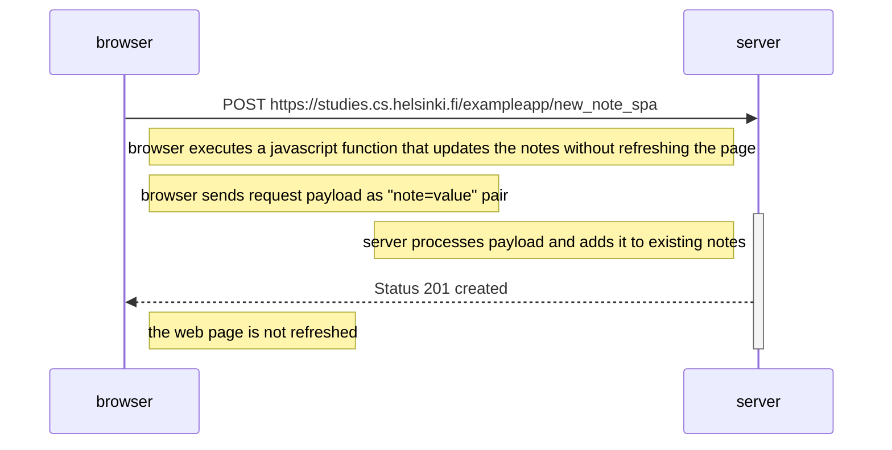

```mermaid
sequenceDiagram
    participant browser
    participant server

    browser->>server: POST https://studies.cs.helsinki.fi/exampleapp/new_note_spa
    Note right of browser: browser executes a javascript function that updates the notes without refreshing the page 
    Note right of browser: browser sends request payload as "note=value" pair
    activate server

    Note left of server: server processes payload and adds it to existing notes
    server-->>browser: Status 201 created
    Note right of browser: the web page is not refreshed
    deactivate server
```
