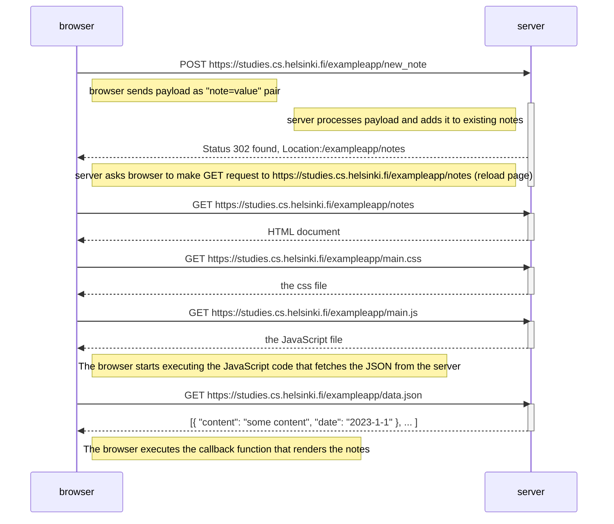

```mermaid
sequenceDiagram
    participant browser
    participant server

    
    browser->>server: POST https://studies.cs.helsinki.fi/exampleapp/new_note 
    Note right of browser: browser sends payload as "note=value" pair
    activate server
    Note left of server: server processes payload and adds it to existing notes
    server-->>browser: Status 302 found, Location:/exampleapp/notes
    Note left of server: server asks browser to make GET request to https://studies.cs.helsinki.fi/exampleapp/notes (reload page)
    deactivate server

    browser->>server: GET https://studies.cs.helsinki.fi/exampleapp/notes
    activate server
    server-->>browser: HTML document
    deactivate server

    browser->>server: GET https://studies.cs.helsinki.fi/exampleapp/main.css
    activate server
    server-->>browser: the css file
    deactivate server

    browser->>server: GET https://studies.cs.helsinki.fi/exampleapp/main.js
    activate server
    server-->>browser: the JavaScript file
    deactivate server

    Note right of browser: The browser starts executing the JavaScript code that fetches the JSON from the server

    browser->>server: GET https://studies.cs.helsinki.fi/exampleapp/data.json
    activate server
    server-->>browser: [{ "content": "some content", "date": "2023-1-1" }, ... ]
    deactivate server

    Note right of browser: The browser executes the callback function that renders the notes
```
